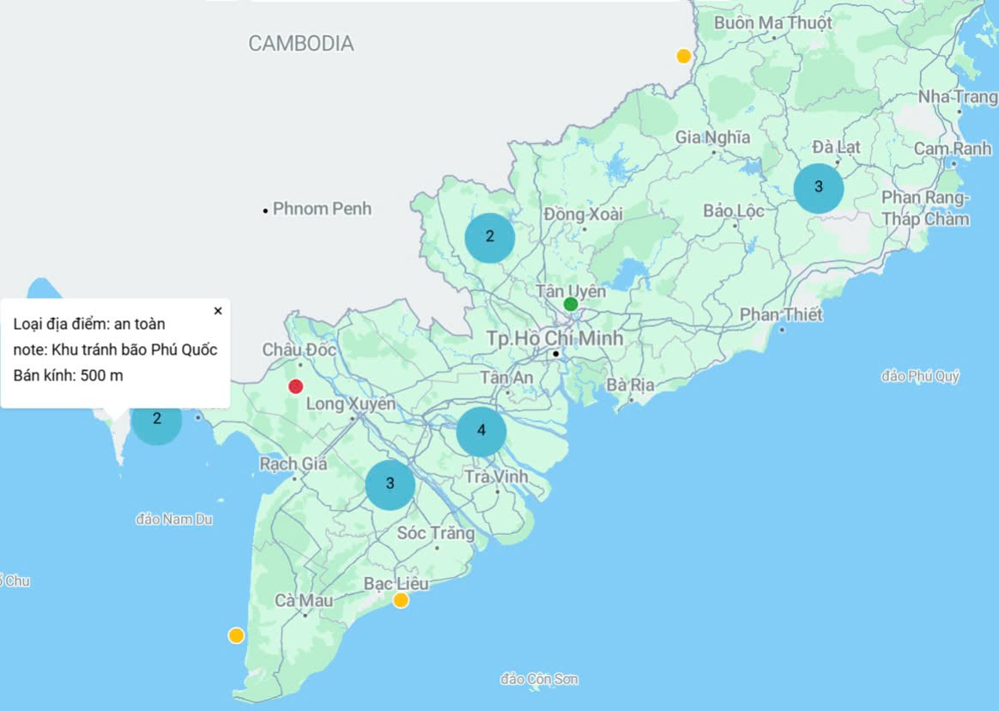

 

  

  <h3 align="center">Safe You</h3>

  

   Phần mềm mã nguồn mở hỗ trợ ứng phó tình huống khẩn cấp, khắc phục thiệt hại và cung cấp thông tin an toàn cho cộng đồng. 
     
    <a href="https://ute-safeyou.github.io/safeyou-docs/"><strong>Tài liệu phát triển »</strong></a>
     
     
    <a href="https://olp-asm.huuloc.id.vn/app/safeyou-internals/admin-authentication-67543a23fd51167a0308d7b7?branch=master">Online demo</a>
    ·
    <a href="https://github.com/UTE-SafeYou/UTE-SafeYou/issues/new?assignees=&labels=&projects=&template=%F0%9F%90%9E-b%C3%A1o-c%C3%A1o-l%E1%BB%97i-.md&title=">Báo cáo lỗi</a>
    ·
    <a href="https://github.com/UTE-SafeYou/UTE-SafeYou/issues/new?assignees=&labels=&projects=&template=%F0%9F%92%A1-y%C3%AAu-c%E1%BA%A7u-t%C3%ADnh-n%C4%83ng.md&title=">Yêu cầu tính năng</a>
  

## Về Safe You Project 👋

Safe You Project là một nền tảng ứng dụng công nghệ thông tin nhằm giải quyết các vấn đề trong việc ứng phó với các tình huống khẩn cấp, đặc biệt là trong các trường hợp thiên tai và đại dịch. Trong bối cảnh tình hình khẩn cấp, việc quản lý, giao tiếp và điều hành giữa các cấp phải thực hiện qua nhiều bước thủ công, gây ra sự chậm trễ và khó khăn trong việc phối hợp. Điều này dẫn đến sự thiếu hiệu quả trong việc phản ứng nhanh chóng và kịp thời.

Giá trị cốt lõi của Safe You Team:

- Yêu thương 💖
- Chủ động 🌱
- Tận tâm 🌼
